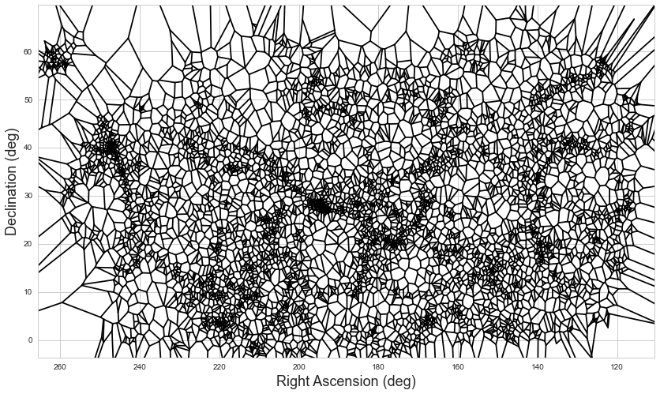

# LSS Mapper
<br>
<br>
Mapping the large scale structure (LSS) of the Universe

<p align="center">
  
</p>

## Purpose
During the course of my PhD thesis at the University of Massachusetts, I worked on the difficult challenge 
of how best to characterize the environments of galaxies in the Universe at large, with the ultimate goal 
of understanding the role of environment in the evolution of galaxies.

The technique that I settled on was actually a combination of two distinct, but complementary, methods:

 - Voronoi Tessellation
 - the Minimum Spanning Tree

**Why use these two techniques together?**

Voronoi Tessellation provides a valuable measure of the projected density immediately around a given 
galaxy; in other words, it's a great example of a "nearest neighbor" approach to measuring the environment.
Meanwhile, the Minimum Spanning Tree is better at identifying structures on larger scales and with no 
assumptions about the geometry of the objects, thus making it similar in practice to a "fixed aperture" 
technique. Based on one of the more extensive studies comparing different measures of environment 
(Muldrew et al. 2012), the optimum approach to measuring environment is a combination of a nearest-neighbor 
and a fixed-aperture technique, given each of their inherent biases.

## Prerequisites
In order to use the lss mapper, you will need to have some of the standard Python libraries installed:
 - scipy
 - numpy
 - pandas
 - matplotlib
 - seaborn

In addition to these, you'll need to install <a href="https://github.com/jakevdp/mst_clustering">MSTClustering from jakevdp</a>.
The easiest way to install this is to use a package installer like pip, with:

```
pip install mst_clustering
```

## Citing

If you use this for your research, please cite <a href="http://adsabs.harvard.edu/abs/2014MNRAS.439.3564C">my 2014 paper</a> that introduced the idea of mapping the LSS of the Universe using these two techniques.
